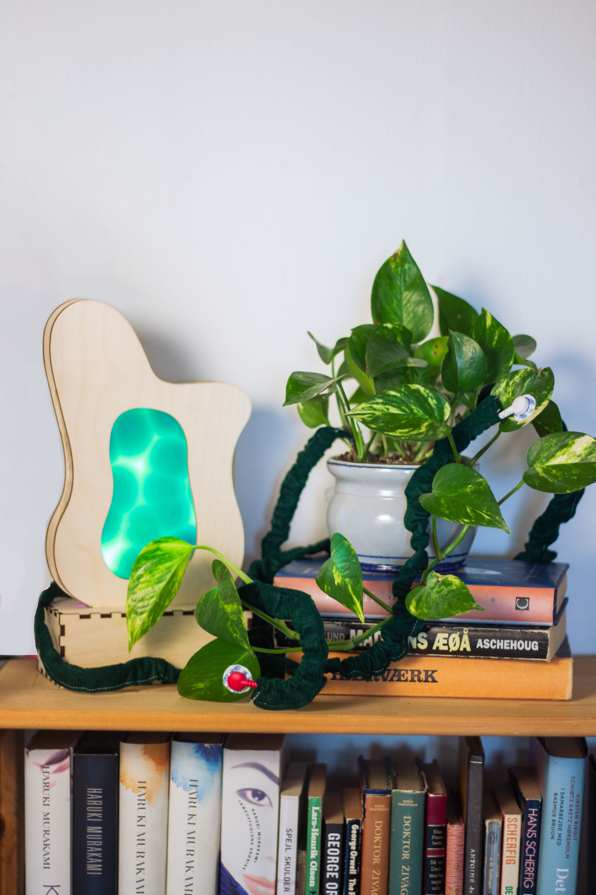
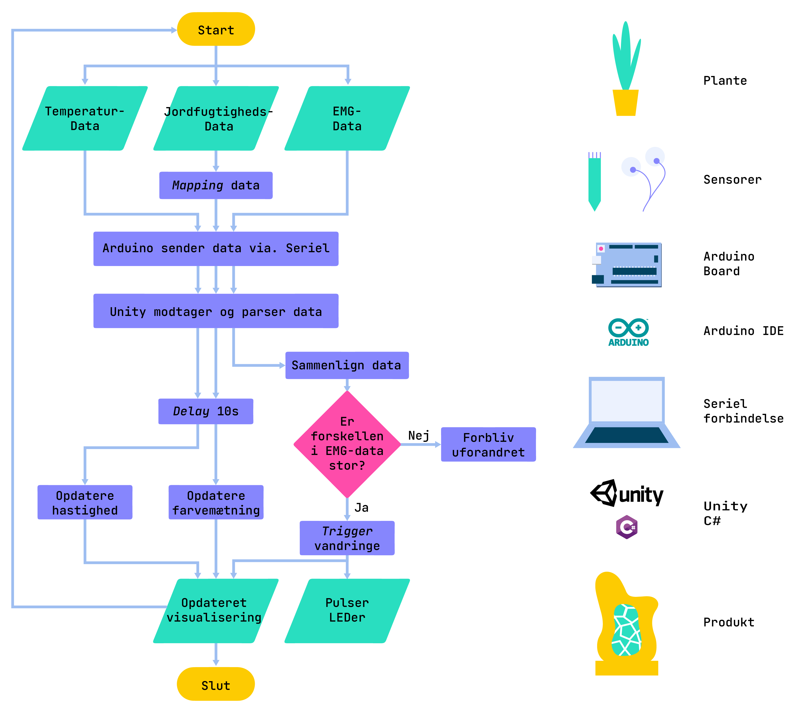

# Speciale_PlantebaseretTeknologi
Dette repository indeholder kode og setup af mit specialeprodukt.

## Arduino
Et Arduino Uno board (Metro) er brugt i dette projekt  
[Jordfugtighed- og temperatursensor](https://learn.adafruit.com/adafruit-stemma-soil-sensor-i2c-capacitive-moisture-sensor/arduino-test) sættes i SCL og SDA  
[EMG-sensor](https://wiki.seeedstudio.com/Grove-EMG_Detector/) sættes i pin A0  
LED'er sættes i pin 6  
Alle tre sættes i 5V og GND  
Boadet connectes til PC for strøm og seriel forbindelse med Unity  

## Unity
Man kan enten åbne projektet i Unity version: 2020.3.4f1 (OBS Universal Rendering Pipeline (URP) er brugt)  
Eller man kan køre Unity buildet, som er en eksekverbar fil, der kører uafhængig af Unity. Download Unity build mappen og kør .exe filen  
Skærmen er connected til PC gennem HDMI, og Unity scenen er tilpasset skærmens størrelse.  

## Flowchart over koden

## Video demo
Youtube link til demonstration af produktets funktionaliteter: https://youtu.be/KQpG1MwNubM
